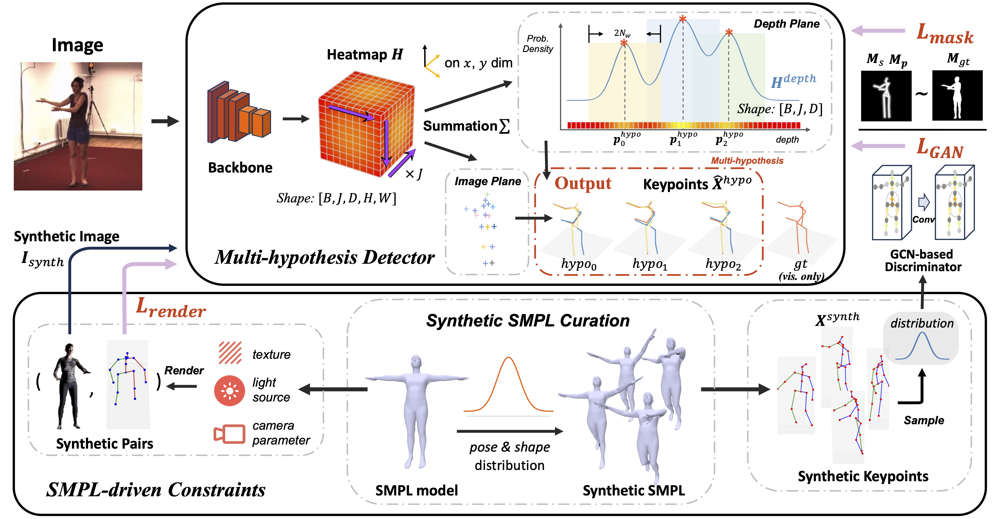

# X as Supervision: Contending with Depth Ambiguity in Unsupervised Monocular 3D Pose Estimation

<p align="center">
    <a href="https://charrrrrlie.github.io/">Yuchen Yang</a>
    &nbsp;·&nbsp;
    <a href="https://EMPTY">Xuanyi Liu</a>
    &nbsp;·&nbsp;
    <a href="https://EMPTY">Xing Gao</a>
    &nbsp;·&nbsp;
    <a href="https://zzh-tech.github.io/">Zhihang Zhong</a>
    &nbsp;·&nbsp;
    <a href="https://jimmysuen.github.io/">Xiao Sun</a><br>
</p>

#### <p align="center">[arXiv](https://arxiv.org/abs/2411.13026)</p>

# 


## Installation
Refer to [INSTALL.md](doc/INSTALL.md)

## Data Preparation
Refer to [DATA_PREPARATION.md](doc/DATA_PREPARATION.md)

## Get Started
We provide scripts for training and testing on SLURM. Tensorboard records are saved in `log` directory.

You can manually launch the task using `torchrun` in the script.
### Train
```bash
cd scripts
./launch_train.sh <partition> <gpu_num> ../config/<config_name>S1.yaml <extra_tag(optional)>
```

### Finetune
```bash
./launch_finetune.sh <partition> <gpu_num> ../config/<config_name>S2.yaml ../log/<checkpoint_name>/<checkpoint>.pth.tar <extra_tag(optional)>
```

### Eval
`eval_mode: ['best', 'confident']`
```bash
./launch_eval.sh <partition> <gpu_num> ../config/<config_name>S2.yaml ../log/<checkpoint_name>/<checkpoint>.pth <eval_mode>
```


### Note
We conduct experiments in two stages: training with `*S1.yaml` and finetuning with `*S2.yaml`. One-stage training also works, but the performance is not as good as two-stage training.

Configs are named in \<dataset\>\_\<detector_type\>\_\<distribution_type\>\<stage\>.yaml. 

Further experiment code and configs, including 3D-2D mix training, single hypothesis, ... can be found in [this url](https://drive.google.com/drive/folders/1xvSfSb15O3x8PYQDm6_9Aq9RenEf5M7n?usp=sharing).

### Model Zoo
We provide the pretrained models in [this url](https://drive.google.com/drive/folders/1wv7NeFQosIutCbrO8pF2XSsgfXmRBWMZ?usp=sharing).

## Citation
If you find this work useful in your research, please consider citing:
```bibtex
@misc{yang2024X,
      title={X as Supervision: Contending with Depth Ambiguity in Unsupervised Monocular 3D Pose Estimation}, 
      author={Yuchen, Yang and Xuanyi, Liu and Xing, Gao and Zhihang, Zhong and Xiao, Sun},
      year={2024},
      eprint={2411.13026},
      archivePrefix={arXiv},
      primaryClass={cs.CV}
}
```
## Acknowledgement
We thank the authors of [3D Pose Baseline](https://github.com/una-dinosauria/3d-pose-baseline), [MMHuman3D](https://github.com/open-mmlab/mmhuman3d), [IntegralPose](https://github.com/JimmySuen/integral-human-pose), [SMPLPytorch](https://github.com/gulvarol/smplpytorch), [FLAME](https://github.com/Rubikplayer/flame-fitting), [Surreal](https://github.com/gulvarol/surreal), [SAM](https://github.com/facebookresearch/segment-anything) for their great works. We partially refer to their codebases for this project.
